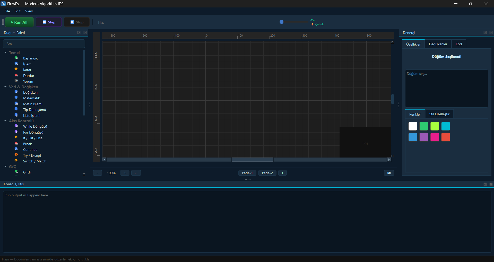
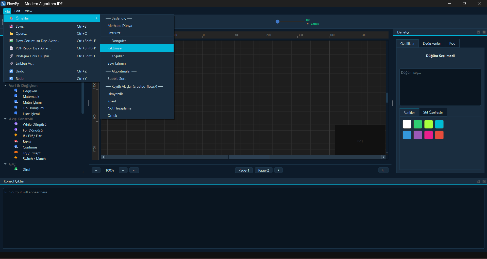
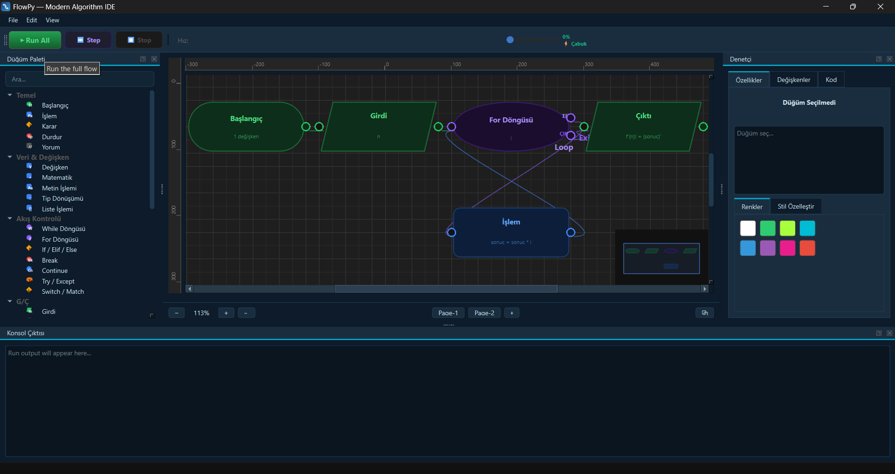
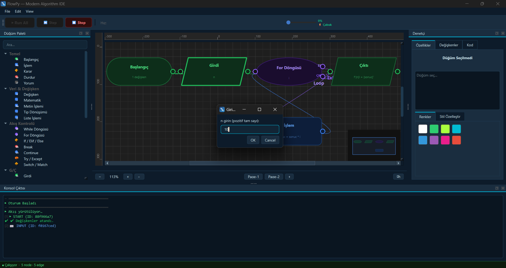
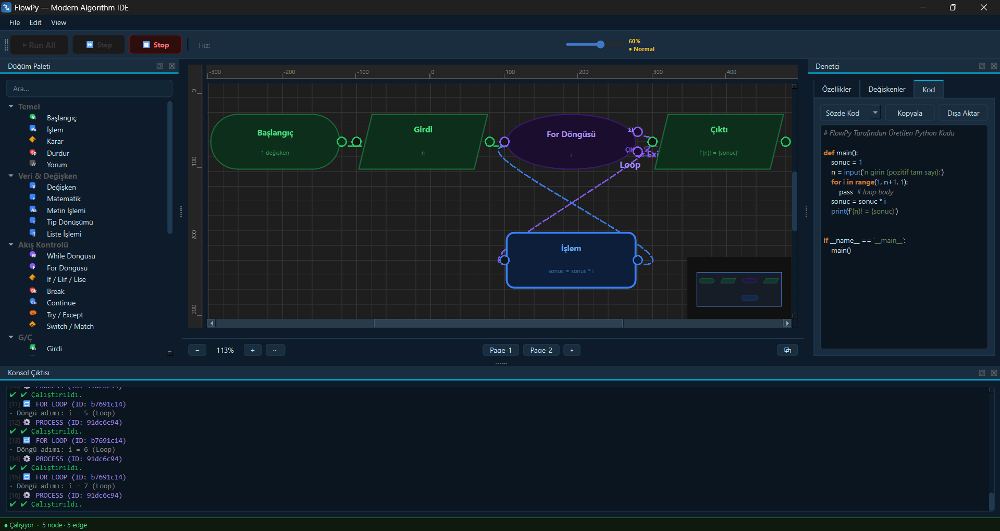
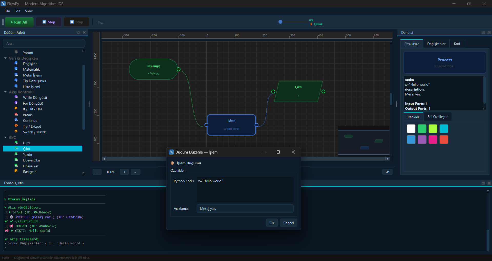

# FlowPy — Modern Algorithm IDE

A desktop IDE for modeling and executing algorithm flows with **drag-and-drop nodes** and automatic Python code generation.

[]()
[]()
[]()
[](#license)

> 🌐 [Türkçe README →](README.tr.md)

---

## Table of Contents

- [About](#about)
- [Key Features](#key-features)
- [Screenshots](#screenshots)
- [Download & Installation](#download--installation)
- [First Run Guide](#first-run-guide)
- [Interface Guide](#interface-guide)
- [Node Reference](#node-reference)
- [Keyboard Shortcuts](#keyboard-shortcuts)
- [Project Structure](#project-structure)
- [FAQ](#faq)
- [Troubleshooting](#troubleshooting)
- [Contributing](#contributing)
- [Roadmap](#roadmap)
- [Technologies](#technologies)
- [License](#license)
- [Support](#support)

---

## About

FlowPy is a desktop application for visually modeling and running Python-based algorithm flows. Users drag blocks from the node palette onto the canvas, connect them together, and FlowPy interprets the flow, displays live variable state, and generates source code from the graph.

**Design algorithms without writing code — then generate the code from your design.**

---

## Key Features

| Feature | Description |
|---------|-------------|
| 🖱️ **Drag-and-drop editor** | Place nodes from the palette and position them on the canvas |
| ▶️ **Run / Step / Stop** | Full-speed or step-by-step execution; active node is highlighted |
| 📊 **Live variable tracking** | Runtime variable values and sparkline charts |
| ✅ **Flow validation** | Detects invalid connections and missing start nodes before running |
| 💻 **Multi-language code generation** | Python, Java, C, C++, JavaScript, and Pseudocode output |
| 🧩 **Rich node library** | Loops, decisions, I/O, file ops, functions, exception handling, lists |
| ↩️ **Undo / Redo** | Unlimited history with Ctrl+Z / Ctrl+Y |
| 🗺️ **Minimap, rulers & zoom** | Navigate large flows with ease |
| 📄 **Multi-page canvas** | Page-1, Page-2 and the **+** button to add unlimited pages |
| 🎨 **Style customization** | Node colors, opacity, and border style |
| 📦 **Built-in sample flows** | FizzBuzz, Factorial, Bubble Sort, and more |
| 🔗 **Share link** | Share a flow via URL in one click |
| 📸 **Export** | Save as PNG image or PDF report |
| 🧭 **Guided tour** | 7-step interactive UI walkthrough |

---

## Screenshots

| Main Screen | File Menu — Examples |
|-------------|----------------------|
|  |  |

| Factorial Flow | Running — Input Dialog |
|----------------|------------------------|
|  |  |

| Code Generation | Node Editor |
|-----------------|-------------|
|  |  |

---

## Download & Installation

### Install from GitHub Releases

1. Open the [Releases](https://github.com/flowpy-ide/FlowPy/releases/latest) page.
2. Download the latest build: `FlowPy.exe` or `FlowPy-win64.zip`.
3. If you downloaded a ZIP archive, extract it.
4. Run `FlowPy.exe`.
5. If Windows SmartScreen appears, choose **"More info" → "Run anyway"**.

> When using the `.exe` distribution, Python installation is **not required**.

### Run from source

**Requirements:** Python 3.10+, pip

```powershell
cd C:\yedekler\Flow-py\FlowPy
python -m venv .venv
.\.venv\Scripts\Activate.ps1
python -m pip install --upgrade pip
python -m pip install -r requirements.txt
python main.py
```

---

## First Run Guide

1. Launch the application — a welcome screen appears.
2. Choose **"Start with sample flow"** or **"Start with empty canvas"**.
3. If a **guided tour** starts (7 steps), explore the interface or click "Skip Tour".
4. Drag a **Start** node from the left panel onto the canvas.
5. Add more nodes and **connect their ports** (drag from an output port to an input port).
6. **Double-click** a node to edit its properties.
7. Click **Run All** to execute or **Step** to advance one node at a time.
8. Watch the console for output and the right panel for generated code.
9. Save with `File > Save (Ctrl+S)` as a `.flowpy` file.

---

## Interface Guide

### Toolbar

| Button | Shortcut | Function |
|--------|----------|----------|
| **Run All** | — | Execute the full flow from start to end |
| **Step** | — | Execute the next node |
| **Stop** | — | Stop a running flow |
| **Speed slider** | — | "Fast" mode skips animations |

### Node Palette (Left Panel)

Two ways to add a node to the canvas:
- **Drag & drop** — click a node in the palette and drag it onto the canvas
- **Double-click** — node is placed at the canvas center

Use the search box at the top to filter nodes.

### Canvas

- **Pan mode** — activate the `··` button in the bottom bar, then drag the canvas
- **Zoom** — `−` / `+` buttons or `Ctrl + scroll wheel`
- **Multi-select** — click an empty area and draw a selection rectangle
- **Rulers** — horizontal and vertical coordinate rulers for guidance
- **Minimap** — small flow overview in the bottom-right corner; helps navigate large flows

### Multi-Page Canvas

The bottom bar shows **Page-1**, **Page-2**, and the **+** button.

- Each click of **+** adds a new independent page (Page-3, Page-4, …)
- Each page stores its own flow and canvas state independently
- Switching pages saves the current page automatically

### Inspector Panel (Right Panel)

| Tab | Content |
|-----|---------|
| **Properties** | Selected node type, ID, and property values; style editing |
| **Variables** | Live variable table and sparkline charts during execution |
| **Code** | Generated Python / Pseudocode — Copy / Export buttons |

### Edit Menu

| Action | Shortcut | Description |
|--------|----------|-------------|
| Undo | Ctrl+Z | Revert the last change |
| Redo | Ctrl+Y | Reapply the reverted change |
| Copy | Ctrl+C | Copy selected nodes to clipboard |
| Paste | Ctrl+V | Paste nodes from clipboard |
| Duplicate | Ctrl+D | Copy and immediately paste selected nodes |
| Align > Horizontal | — | Align selected nodes on the horizontal axis |
| Align > Vertical | — | Align selected nodes on the vertical axis |
| Align > Grid | — | Auto-arrange selected nodes in a grid layout |

### File Menu

| Action | Shortcut | Description |
|--------|----------|-------------|
| Save | Ctrl+S | Save as `.flowpy` or `.json` |
| Open | Ctrl+O | Load a saved flow file |
| Export Flow Image | Ctrl+Shift+E | Save canvas as a PNG image |
| Export PDF Report | Ctrl+Shift+P | Generate a PDF with flow + code |
| Create Share Link | Ctrl+Shift+L | Share the flow via URL |
| Open from Link | — | Load a flow by pasting a share URL |

---

## Node Reference

### Basic

| Node | Description |
|------|-------------|
| **Start** | The single, required entry point of every flow |
| **Process** | Any Python expression or variable assignment |
| **Decision** | `if / elif / else` branching; True and False output ports |
| **Stop** | Terminates the flow at that point |
| **Comment** | Generates no code; used for canvas annotations |

### Data & Variables

| Node | Description |
|------|-------------|
| **Variable** | Assigns a value to a variable (`x = 5`) |
| **Math** | Evaluates a mathematical expression |
| **String Op** | String concatenation, splitting, formatting |
| **Type Cast** | Converts types: `int()`, `float()`, `str()`, etc. |
| **List Op** | Create lists, `append`, `remove`, slicing |

### Flow Control

| Node | Description |
|------|-------------|
| **While Loop** | Loops while a condition is true; Loop and Exit ports |
| **For Loop** | Counter-range loop; Loop and Exit ports |
| **If / Elif / Else** | Multi-branch conditional flow |
| **Break** | Immediately terminates the nearest loop |
| **Continue** | Skips the current iteration and continues |
| **Try / Except** | Exception handling block; Try and Except ports |
| **Switch / Match** | Python 3.10+ `match-case` construct |

### I/O (Input / Output)

| Node | Description |
|------|-------------|
| **Input** | Gets a value from the user via `input()`; shows a dialog at runtime |
| **Output** | Prints a variable or expression to the console |
| **Print** | Formatted text output (`print`) |
| **File Read** | Reads a file and assigns the content to a variable |
| **File Write** | Writes a variable or text to a file |
| **Random** | Generates a random number using the `random` module |

### Function

| Node | Description |
|------|-------------|
| **Function** | Defines a function with `def`; use **＋ Add Parameter** to add dynamic parameter rows, **×** to remove one |
| **Return** | Returns a value from a function |

> **Function Parameters:** When editing a Function node, each parameter is shown as its own row.
> Click **＋ Add Parameter** to add a new row. Click **×** to remove one.
> On save, parameters are joined as `a, b, c` → `def function_name(a, b, c):`

---

## Keyboard Shortcuts

| Shortcut | Action |
|----------|--------|
| `Ctrl+S` | Save |
| `Ctrl+O` | Open |
| `Ctrl+Z` | Undo |
| `Ctrl+Y` | Redo |
| `Ctrl+C` | Copy selected nodes |
| `Ctrl+V` | Paste |
| `Ctrl+D` | Duplicate selected nodes |
| `Ctrl+Shift+E` | Export canvas as PNG |
| `Ctrl+Shift+P` | Export PDF report |
| `Ctrl+Shift+L` | Create share link |
| `Ctrl++` | Zoom in |
| `Ctrl+-` | Zoom out |
| `Delete` / `Backspace` | Delete selected nodes and edges |
| Double-click | Open node editor dialog |
| Drag & drop | Add node from palette to canvas |

---

## Project Structure

```
FlowPy/
├── main.py                   # Application entry point and MainWindow
├── requirements.txt          # Python dependencies
├── core/
│   ├── interpreter.py        # Flow interpreter / executor
│   ├── generator.py          # Multi-language code generator
│   ├── validator.py          # Flow validation engine
│   ├── serializer.py         # .flowpy save / load
│   ├── templates.py          # Built-in sample flow templates
│   ├── undo.py               # Undo / Redo manager
│   ├── registry.py           # Node registry
│   ├── settings_manager.py   # Application settings
│   ├── node_visuals.py       # Node visual styles
│   ├── i18n.py               # Multi-language support (TR / EN)
│   ├── i18n_nodes.py         # Node label translations
│   ├── i18n_node_docs.py     # Node documentation strings
│   └── syntax_highlighter.py # Code tab syntax highlighting
├── models/
│   ├── node.py               # Node data model
│   └── edge.py               # Edge (connection) data model
├── views/
│   ├── mainwindow.ui         # Qt Designer UI definition
│   ├── canvas.py             # Flow canvas scene
│   ├── node_editor_dialog.py # Node property editor dialog
│   ├── settings_dialog.py    # Settings window
│   ├── welcome_screen.py     # Welcome / splash screen
│   ├── guided_tour.py        # 7-step interactive guided tour
│   ├── minimap.py            # Minimap widget
│   ├── variable_chart.py     # Variable sparkline charts
│   └── node_tooltip.py       # Node hover tooltip balloon
├── created_flows/            # Ready-to-use .flowpy sample flows
└── docs/                     # Documentation and design assets
```

---

## System Requirements

| Requirement | Detail |
|-------------|--------|
| OS | Windows 10 / 11 (64-bit) |
| RAM | 4 GB recommended |
| Disk | 200 MB free space |
| Python | 3.10+ (for running from source) |
| Dependency | PyQt6 (for running from source) |

---

## FAQ

**My flow won't run — what should I check?**
- Make sure there is a **Start** node on the canvas.
- Verify all nodes are connected; disconnected nodes are skipped.
- Read the error message in the console panel — the node ID shows where the problem occurred.

**How do I add more pages?**
Click the **+** button in the bottom bar. Each page holds an independent canvas and flow. There is no limit on the number of pages.

**How do I add multiple parameters to a Function node?**
Double-click the Function node. In the editor window, click **＋ Add Parameter** for each parameter you need. Type the name in each row; click **×** to remove one.

**Windows SmartScreen is blocking the app — what do I do?**
Click "More info" → "Run anyway". Alternatively right-click the `.exe` → Properties → check "Unblock".

**How do I get the generated code?**
Open the **Inspector > Code** tab in the right panel. Use **Copy** to copy to clipboard or **Export** to save as a `.py` file.

**How do I share a flow?**
Use `File > Create Share Link (Ctrl+Shift+L)` to generate a URL. The recipient can load it via `File > Open from Link`.

**Can I restart the guided tour?**
Yes — open the **View** menu and start the guided tour again at any time.

---

## Troubleshooting

| Problem | Solution |
|---------|----------|
| App won't start | Ensure Python 3.10+ and PyQt6 are installed |
| Missing dependency error | Run `pip install -r requirements.txt` |
| Save error | Run the app from a folder with write permission |
| Flow won't load | The `.flowpy` file may be corrupted; try a sample from `created_flows/` |
| SmartScreen blocking | Right-click `.exe` → Properties → Unblock |
| No console output | Is there a Start node? Are all nodes connected? |

---

## Contributing

1. Fork the repository.
2. Create a new branch: `git checkout -b feature/<short-description>`
3. Commit your changes.
4. Submit a pull request.

Please follow the existing `core/` → `models/` → `views/` architecture and maintain TR/EN language support (`core/i18n*.py`).

---

## Roadmap

- [ ] Automated GitHub Releases packaging for Windows
- [ ] macOS / Linux support
- [ ] `.flowpy` versioning and improved import/export
- [ ] Plugin support and custom node templates
- [ ] Real-time collaboration (multiplayer flow editing)

---

## Technologies

- **Python 3.10+**
- **PyQt6** — Qt-based desktop UI
- **Qt Designer** — `.ui`-based UI definition
- Visual flow canvas, undo/redo, live variable tracking
- Code generation: Python, Java, C, C++, JavaScript, Pseudocode

---

## License

This repository does not yet contain a `LICENSE` file. Add an appropriate open source license before official distribution.

---

## Support

- 🐛 **Issues & feature requests:** `https://github.com/flowpy-ide/FlowPy/issues`
- 👤 **Maintainers:** Erkan TURGUT, Aslı AYDIN
- 📦 **Release notes:** GitHub Releases page
