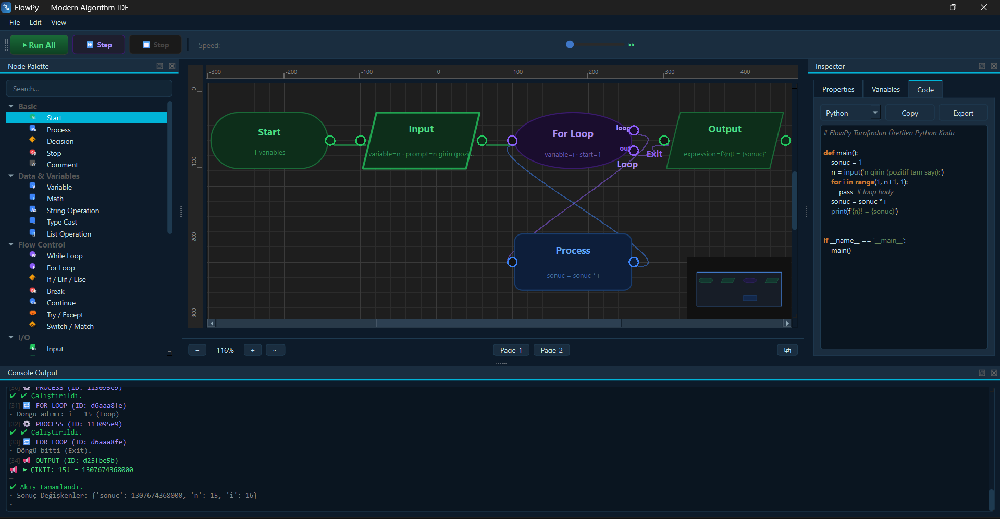
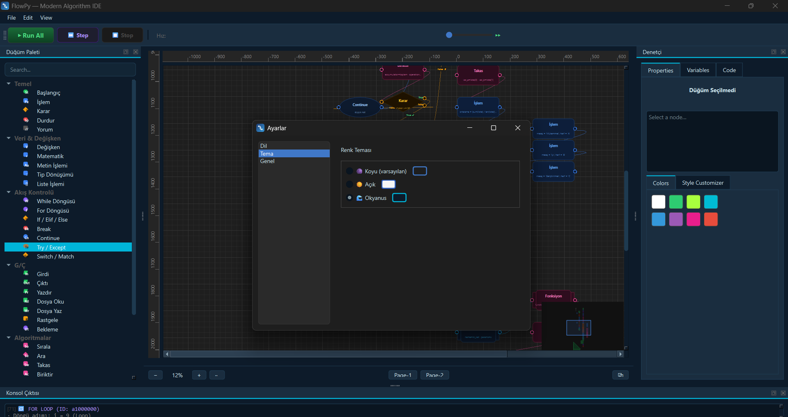
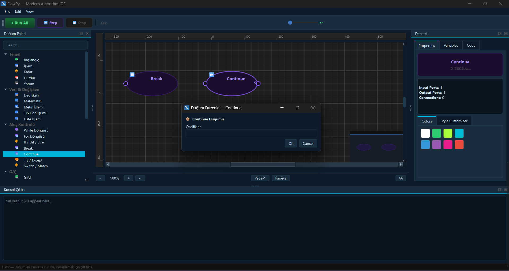

# FlowPy

Algoritmik akışları sürükle-bırak düğümlerle modelleyip çalıştıran masaüstü IDE.

[](https://github.com/<ORG>/<REPO>/releases/latest)
[](https://github.com/<ORG>/<REPO>/releases/latest)
[](#lisans)
[]()
[]()
[](https://github.com/<ORG>/<REPO>/issues)
[](https://github.com/<ORG>/<REPO>)

---

## Hakkında

FlowPy, Python tabanlı algoritma akışlarını grafiksel olarak modelleyen ve çalıştıran bir masaüstü uygulamadır. Kullanıcılar node paletinden düğümleri canvas üzerine sürükleyerek akış tasarlar, akışı çalıştırır, değişkenleri canlı izler ve aynı akıştan kod üretebilir.

## Öne Çıkan Özellikler

- **Sürükle-bırak akış editörü**: Düğümleri palette seçip canvas üzerinde yerleştirin.
- **Run / Step / Stop**: Akışı tam hızda veya adım adım yürütün, durdurun.
- **Canlı değişken takibi**: Çalışma zamanında değişken değerleri ve sparkline grafikleri gösterilir.
- **Akış doğrulama**: Geçersiz akışları çalıştırmadan önce tespit eder.
- **Kod üretimi**: Python, Java, C, C++, JavaScript ve Pseudocode çıktısı alabilirsiniz.
- **Geniş düğüm kütüphanesi**: Döngüler, karar, I/O, dosya işlemleri, fonksiyonlar, hata yakalama, listeler ve daha fazlası.
- **Undo / Redo**: Düzenleme adımlarını geri alıp yeniden uygulama desteği.
- **Minimap, cetvel ve zoom**: Büyük akışları kolayca düzenleyin.
- **Örnek akışlar**: `created_flows/tam_demo.flowpy` gibi hazır demo senaryolar içerir.
- **Stil özelleştirme**: Düğüm renklerini ve görünümlerini değiştirin.

## Neden FlowPy?

FlowPy, algoritma tasarımı ve mantık akışını görselleştirmek isteyen kullanıcılar için tasarlanmıştır. Aşağıdaki gruplar için uygundur:

- **Öğrenciler**: Algoritma adımlarını görerek öğrenmek isteyenler.
- **Eğitimciler**: Akış diyagramını somut olarak göstermek isteyen öğretmenler.
- **Geliştiriciler**: Hızlı prototip, mantık doğrulama ve kod çıktısı almak isteyen yazılımcılar.
- **Teknik olmayan kullanıcılar**: Kod yazmadan süreçleri modelliyor ve test ediyor.

## İndirme ve Kurulum

### GitHub Releases üzerinden yükleme

1. `https://github.com/<ORG>/<REPO>/releases/latest` sayfasını açın.
2. En son sürümü indirin: `FlowPy.exe` veya `FlowPy-win64.zip`.
3. ZIP dosyası indirdiyseniz içeriğini çıkartın.
4. `FlowPy.exe` dosyasını çalıştırın.
5. Windows SmartScreen uyarısı çıkarsa "Daha fazla bilgi" → "Yine de çalıştır" seçeneğini kullanın.

> Not: `.exe` dağıtımı varsa Python kurulumu gerekmeyebilir.

### Kaynak koddan çalıştırma

1. Proje dizinine gidin.
2. Sanal ortam oluşturun ve etkinleştirin.
3. Bağımlılıkları yükleyin.

```powershell
cd c:\yedekler\Flow-py\FlowPy
python -m venv .venv
\.venv\Scripts\Activate.ps1
python -m pip install --upgrade pip
python -m pip install -r requirements.txt
python main.py
```

## İlk Çalıştırma Rehberi

1. Uygulamayı başlatın.
2. Açılış ekranında "Örnek Akış ile Başla" veya "Boş Canvas ile Başla" seçin.
3. Sol panelden düğümleri canvas üzerine sürükleyin.
4. Düğümü çift tıklayarak özelliklerini düzenleyin.
5. Düğümleri birbirine bağlayın.
6. Sağ üstteki "Run" ile akışı çalıştırın veya "Step" ile adım adım yürütün.
7. Alt panelde çıktı ve değişken izleyiciyi takip edin.
8. Çalışmanızı kaydetmek için `Dosya > Kaydet` ile `.flowpy` dosyası oluşturun.

## Ekran Görüntüleri

  
  
  

## Sistem Gereksinimleri

- Windows 10 veya Windows 11 (64-bit)
- 4 GB RAM önerilir
- 200 MB boş disk alanı
- Kaynak koddan çalıştırma için Python 3.10+ ve PyQt6

## Proje Yapısı

| Klasör / Dosya | Açıklama |
| --- | --- |
| `main.py` | Uygulamanın ana giriş noktası |
| `requirements.txt` | Python bağımlılıkları |
| `core/` | Yorumlayıcı, kod üretici, doğrulama, ayar yönetimi ve undo/redo |
| `models/` | Node ve edge veri modelleri |
| `views/` | Qt tabanlı kullanıcı arayüzü bileşenleri |
| `created_flows/` | Hazır `.flowpy` örnek akışlar |
| `docs/` | Dokümantasyon ve tasarım varlıkları |

## Sık Sorulan Sorular

### Windows SmartScreen uyarısı alırsam ne yapmalıyım?
İndirilen `.exe` yeni veya imzalanmamış ise bu uyarı çıkabilir. "Daha fazla bilgi" → "Yine de çalıştır" seçeneğini kullanın.

### Projeler nerede saklanır?
FlowPy, kaydetme sırasında seçtiğiniz klasöre `.flowpy` dosyası yazar. Örnek akışlar `created_flows/` dizininde bulunur.

### Kod üretimini nasıl alırım?
Uygulama içindeki kod üretim panelinden dili seçip, üretilen kodu kopyalayabilirsiniz.

### Nasıl güncellerim?
GitHub Releases sayfasından en son sürümü indirip yeniden açın. Kaydedilen `.flowpy` dosyalarınız korunur.

### Hata bildirmek istersem ne yapmalıyım?
Proje deposunun Issues bölümünden yeni bir konu açın.

## Sorun Giderme

- **Uygulama açılmıyor:** Kaynak koddan çalışıyorsanız Python 3.10+ ve PyQt6 yüklü olduğundan emin olun.
- **Eksik bağımlılık:** `python -m pip install -r requirements.txt` çalıştırın.
- **Kaydetme hatası:** Uygulamayı yazma izni olan klasörde çalıştırın.
- **Akış yüklenmiyor:** `.flowpy` dosyası bozulmuş olabilir; `created_flows/` altındaki örneği deneyin.
- **SmartScreen engellemesi:** İndirilen `.exe` üzerindeki sağ tıklamadan "Özellikler" > "Engellemeyi kaldır" kontrolünü yapın.

## Katkıda Bulunma

1. Depoyu fork edin.
2. Yeni bir dal açın: `feature/<kısa-açıklama>`.
3. Değişikliklerinizi commitleyin.
4. Pull request gönderin.

Lütfen kod stiline ve mevcut `core/`, `models/`, `views/` mimarisine uyun.

## Yol Haritası

- Windows için otomatik GitHub Releases paketleme
- macOS / Linux desteği
- `flowpy` sürümleme ve içe/dışa aktarım geliştirmeleri
- Eklenti desteği ve düğüm şablonları

## Teknolojiler

- Python 3.10+
- PyQt6
- Qt tabanlı masaüstü arayüz
- Görsel akış sahnesi, undo/redo, canlı değişken izleme
- Kod üretimi: Python, Java, C, C++, JavaScript, Pseudocode


## Destek

- Hata ve özellik talepleri: `(https://github.com/flowpy-ide/FlowPy/issues)`
- Sürüm notları: GitHub Releases sayfası(https://github.com/flowpy-ide/FlowPy/releases/tag/v1.0.0)
